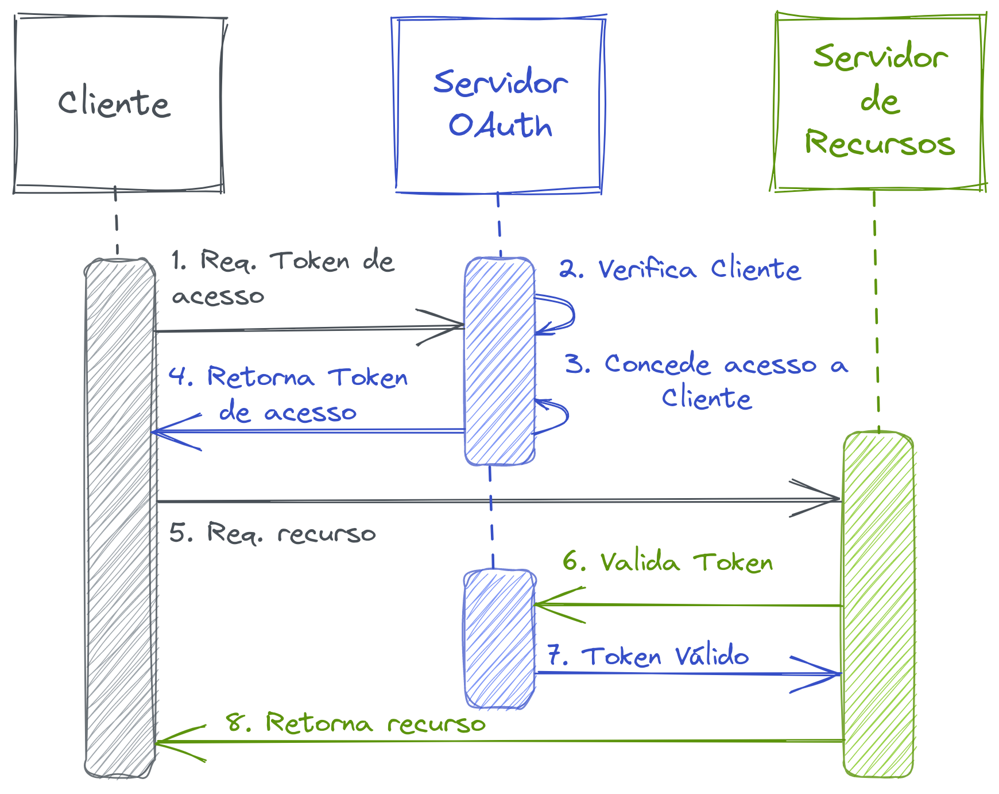

<style>
img {
  display: block;
  margin: 0 auto;
}
</style>

# <!-- fit --> Programação Orientada a Serviços

### Prof. Diego Cirilo

**Aula 04**: Autenticação

---
# Autenticação
- Autenticação
    - Verifica identidade do usuário para o serviço.
- Autorização
    - Verifica as permissões de acesso do usuário.
- Necessária para controle de acesso às APIs
- Basic auth (HTTP)
- API Keys
- OAuth

---
# Basic Auth
- Usa o cabeçalho HTTP
- Necessário passar usuário e senha no request
- Mais simples
- Pouco segura

---
# Exemplo API Github
```python
import requests
from requests.auth import HTTPBasicAuth
from getpass import getpass

user = input("user: ")
password = getpass()
  
response = requests.get('https://api.github.com/user',
            auth = HTTPBasicAuth('dvcirilo', password))
  
print(response.text)
print(response)
```

---
# API Keys
- Serviço disponibiliza as chaves
- Chave é passada no cabeçalho HTTP

---
# Exemplo SUAP

```python
import requests
from getpass import getpass

api_url = "https://suap.ifrn.edu.br/api/"

user = input("user: ")
password = getpass()

data = {"username":user,"password":password}

response = requests.post(api_url+"v2/autenticacao/token/", json=data)
token = response.json()["access"]
print(response.json())

headers = {
    "Authorization": f'Bearer {token}'
}

print(headers)

response = requests.get(api_url+"v2/minhas-informacoes/meus-dados/", json=data, headers=headers)

print(response.text)
print(response)
```

---
# OAuth

- Open Authorization
- Padrão aberto de serviços de autorização
- Usado na maioria dos serviços grandes, ex. Google, Facebook, Twitter, SUAP, etc.

---
# OAuth



---
# OAuth

- Aplicações devem ser registradas no serviço
    - Client ID e Client Secret
    - Redirect URI
- API Disponibiliza:
    - Access Token - URL
    - Authorization URL
- Aplicação deve guardar token (session)

---
# Acesso OAuth do SUAP no Flask

- Registre sua aplicação em https://suap.ifrn.edu.br/api/
- Authorization grant type: `authorization-code`
- Redicert URIs: `http://localhost:5000/login/authorized`
- Guarde o Client ID e Client Secret
- [Exemplo](https://github.com/dvcirilo/pos-ifrn/tree/main/src/suap_oauth)

---
# Tarefa

- Faça um cliente do SUAP com autenticação OAuth que apresente o perfil do usuário com foto e permita a visualização dos boletins, com seleção de ano/semestre.


# <!--fit--> Dúvidas? 🤔
