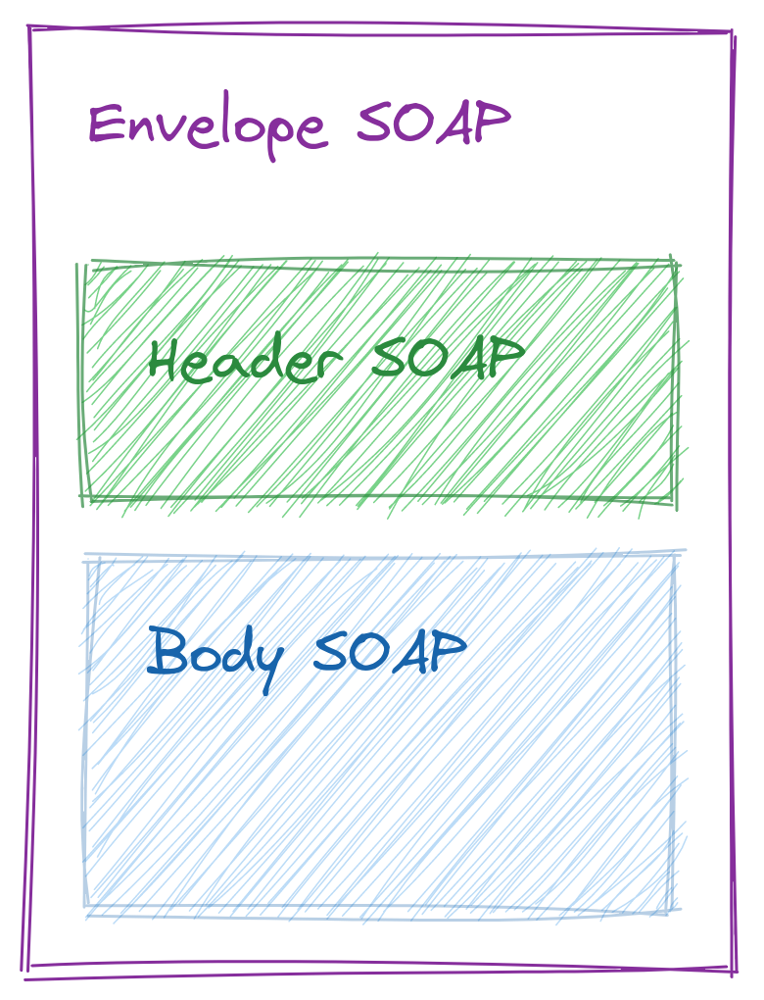

<style>
img {
  display: block;
  margin: 0 auto;
}
</style>

# <!-- fit --> Programação Orientada a Serviços

### Prof. Diego Cirilo

**Aula 12**: APIs SOAP

---
# SOAP
- *Simple Object Access Protocol*
- Usualmente XML sobre HTTP
- Define um protocolo, ao contrário do REST
- Mais antigo, mais complexo e mais bem definido que o REST
- Características:
    - Extensibilidade
    - Neutralidade
    - Independência

---
# SOAP

- Envelope que define a estrutura de mensagens
- Conjunto de regras de *encoding* para expressar os tipos de dados
- Convenção para expressar as chamadas e respostas

---
# Elementos da mensagem SOAP
<style scoped>
table {
  font-size: 18px;
}
</style>

| Elemento  | Descrição                                                | Obrigatório? |
|-----------|----------------------------------------------------------|--------------|
| Envelope  | Identifica o documento XML como uma mensagem SOAP        | Sim          |
| Cabeçalho | Contém informação de cabeçalho (*header*)                | Não          |
| Corpo     | Informações de chamada e retorno (*body*)                | Sim          |
| Falha     | Informações de erros durante o processamento da mensagem | Não          |



---
# WSDL
- *Web Services Description Language*
- Baseado em XML
- Usado para descrever um serviço SOAP, como um *schema*.


---
# Exemplo de API SOAP
- http://webservices.oorsprong.org/websamples.countryinfo/CountryInfoService.wso
- Exemplo de operação: `CountryCurrency`
- Requisição (POST)
```xml
<?xml version="1.0" encoding="utf-8"?>
<soap:Envelope xmlns:soap="http://schemas.xmlsoap.org/soap/envelope/">
  <soap:Body>
    <CountryCurrency xmlns="http://www.oorsprong.org/websamples.countryinfo">
      <sCountryISOCode>string</sCountryISOCode>
    </CountryCurrency>
  </soap:Body>
</soap:Envelope>
```

---
# Exemplo de API SOAP
- Resposta
```xml
<?xml version="1.0" encoding="utf-8"?>
<soap:Envelope xmlns:soap="http://schemas.xmlsoap.org/soap/envelope/">
  <soap:Body>
    <CountryCurrencyResponse xmlns="http://www.oorsprong.org/websamples.countryinfo">
      <CountryCurrencyResult>
        <sISOCode>string</sISOCode>
        <sName>string</sName>
      </CountryCurrencyResult>
    </CountryCurrencyResponse>
  </soap:Body>
</soap:Envelope>
```

---
# Consumindo SOAP com Python
```python
import requests
# URL do serviço SOAP
url = "http://webservices.oorsprong.org/websamples.countryinfo/CountryInfoService.wso"

# XML estruturado
payload = """<?xml version=\"1.0\" encoding=\"utf-8\"?>
			<soap:Envelope xmlns:soap=\"http://schemas.xmlsoap.org/soap/envelope/\">
				<soap:Body>
					<CountryIntPhoneCode xmlns=\"http://www.oorsprong.org/websamples.countryinfo\">
						<sCountryISOCode>BR</sCountryISOCode>
					</CountryIntPhoneCode>
				</soap:Body>
			</soap:Envelope>"""
# headers
headers = {
	'Content-Type': 'text/xml; charset=utf-8'
}
# request POST
response = requests.request("POST", url, headers=headers, data=payload)

# imprime a resposta
print(response.text)
print(response)
```

---
# Tarefa 12
- Acesse o catálogo das funções da API *CountryInfoService*: http://webservices.oorsprong.org/websamples.countryinfo/CountryInfoService.wso
- Escolha 3 funções da lista;
- Escreva um programa que:
    - Apresente um menu para as 3 funções (ex. "Digite 1 para moeda, 2 para etc...");
    - Faça o *parse* dos resultados usando a biblioteca `xml.dom.minidom`;
    - Imprima o resultado na tela;

---
# Zeep

- Biblioteca que facilita a interação com APIs SOAP
- Automaticamente recupera as funções disponíveis através do WSDL e transforma em métodos
- O usuário não precisa operar com XML diretamente
- [Documentação](https://docs.python-zeep.org/en/master/)

---
# Exemplo com Zeep

```python
import zeep

# define a URL do WSDL
wsdl_url = "http://webservices.oorsprong.org/websamples.countryinfo/CountryInfoService.wso?WSDL"

# inicializa o cliente zeep
client = zeep.Client(wsdl=wsdl_url)

# define o código do país para BR
country_code = "BR"

# faz a chamada do serviço
result = client.service.CountryIntPhoneCode(
	sCountryISOCode=country_code
)
# imprime o resultado
print(f"O código de telefone do {country_code} é {result}")

# define o código do país para US
country_code = "US"

# faz a chamada do serviço
result = client.service.CountryIntPhoneCode(
	sCountryISOCode=country_code
)

# imprime o resultado
print(f"O código de telefone do {country_code} é {result}")
```

---
# Tarefa 13

- Acesse a documentação da API de conversão de números [(link)](https://www.dataaccess.com/webservicesserver/NumberConversion.wso);
- Descubra a URL do WSDL;
- Usando essa API e o Zeep, faça um programa que:
    - solicite ao usuário que digite um número inteiro (ex. 223);
    - imprima um número digitado (ex. 223) por extenso em inglês (ex. two hundred and twenty three).

---
# <!--fit--> Dúvidas? 🤔
