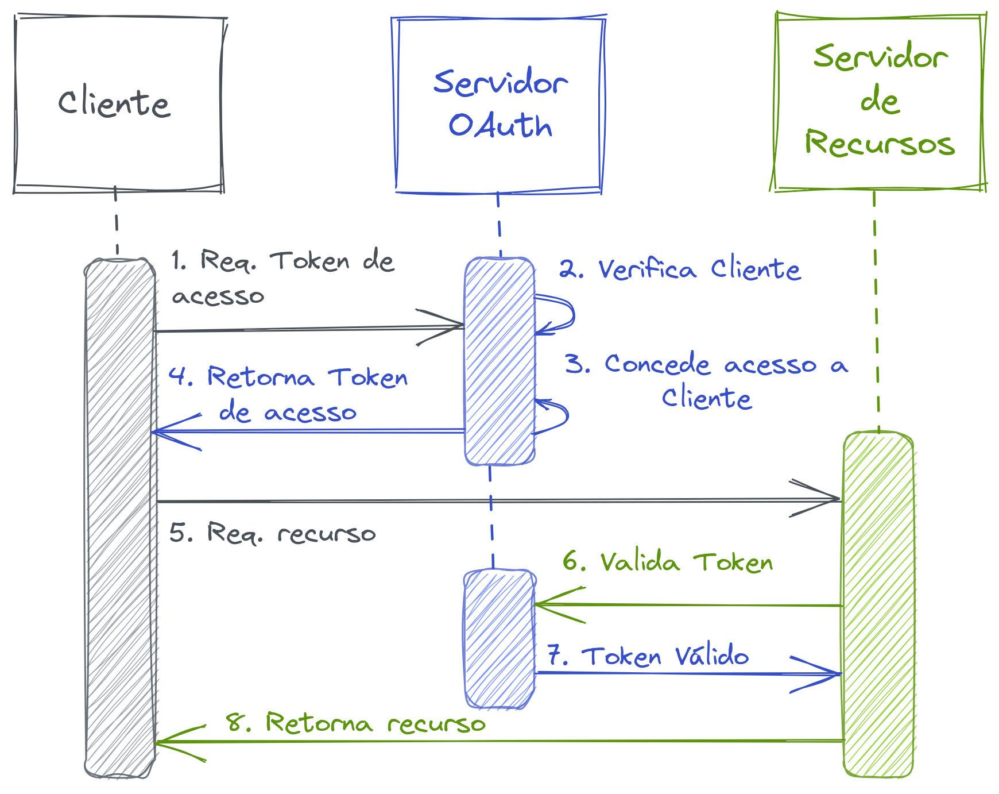

<style>
img {
  display: block;
  margin: 0 auto;
}
</style>

# <!-- fit --> Programação Orientada a Serviços

### Prof. Diego Cirilo

**Aula 13**: Autenticação

---
# Autenticação
- Autenticação
    - Verifica identidade do usuário para o serviço.
- Autorização
    - Verifica as permissões de acesso do usuário.
- Necessária para controle de acesso às APIs
- Basic auth (HTTP)
- API Keys
- OAuth

---
# Basic Auth
- Usa o cabeçalho HTTP
- Necessário passar usuário e senha no request
- Mais simples
- Pouco segura

---
# Exemplo API Github
```python
import requests
from requests.auth import HTTPBasicAuth
from getpass import getpass

user = input("user: ")
password = getpass()
  
response = requests.get('https://api.github.com/user',
            auth = HTTPBasicAuth('dvcirilo', password))
  
print(response.text)
print(response)
```

---
# Prática

- Faça um cliente que consiga listar os seguidores do usuário logado e seguir/parar de seguir um usuário no Github pelo terminal.

---
# API Keys
- Serviço disponibiliza as chaves
- Chave é passada no cabeçalho HTTP

---
# Exemplo SUAP

```python
import requests
from getpass import getpass

api_url = "https://suap.ifrn.edu.br/api/"

user = input("user: ")
password = getpass()

data = {"username":user,"password":password}

response = requests.post(api_url+"token/pair", json=data)
token = response.json()["access"]
print(response.json())

headers = {
    "Authorization": f'Bearer {token}'
}

print(headers)

response = requests.get(api_url+"rh/eu/", headers=headers)

print(response.text)
print(response)
```

---
# Tarefa 14
- Faça um cliente que se autentique com as API Keys do SUAP e retorne o boletim do aluno formatado no terminal.
- A formatação deve ser no estilo tabela, indicando a disciplina e notas de todas as unidades.

---
# OAuth

- Open Authorization
- Padrão aberto de serviços de autorização
- Usado na maioria dos serviços grandes, ex. Google, Facebook, <del>Twitter</del>, SUAP, etc.

---
# OAuth



---
# OAuth

- Aplicações devem ser registradas no serviço
    - Client ID e Client Secret
    - Redirect URI
    - Client Type, Grant Type, etc.
- API Disponibiliza:
    - Access Token - URL
    - Authorization URL
    - Scopes, etc.
- Aplicação deve guardar token (session/cookies) para as próximas requisições.

---
# Tipos de cliente

- *Public*: aplicações onde não é possível esconder o Client Secret (Front-end e Apps).
- *Confidential*: aplicações "*client-side*".

---
# *Grant Flows*

- *Authorization Code*
- *Proof Key for Code Exchange* - PKCE 
- *Implicit*
- *Device Code*
- *OIDC*

---
# Riscos no OAuth

- Client Impersonation

---
# Acesso OAuth do SUAP no Flask

- Registre sua aplicação em https://suap.ifrn.edu.br/api/
- Authorization grant type: `authorization-code`
- Redicert URIs: `http://localhost:5000/login/authorized`
- Guarde o Client ID e Client Secret
- [Exemplo](https://github.com/dvcirilo-ifrn/pos-exemplos/tree/main/suap_oauth)

---
# Acesso OAuth do SUAP com JavaScript

- Registre sua aplicação em https://suap.ifrn.edu.br/api/
- Authorization grant type: `authorization-code`
- Redicert URIs: `http://localhost:8888/login/authorized`
- Guarde o Client ID e Client Secret
- [Exemplo](https://github.com/dvcirilo/cliente_suap_javascript)

---
<style scoped>section { font-size: 26px; }</style>
# Tarefa 15

- Utilizando o Flask, faça um cliente SUAP com 3 páginas:
    - Página inicial com informações do sistema e botão de login com SUAP (OAuth);
    - Página de perfil do usuário com informações principais e foto;
    - Página do boletim, apresentando os dados completos fornecidos pela API, com a possibilidade de seleção de ano.
- As páginas logadas devem exibir o nome/matrícula/avatar do usuário e o botão de logout em uma navbar.
- Caprichem no front-end 😁

---
# Referências
- https://developer.okta.com/blog/2022/06/01/oauth-public-client-identity
- https://auth0.com/docs/get-started/applications/confidential-and-public-applications
- https://www.oauth.com/playground/
- https://www.youtube.com/watch?v=CHzERullHe8

---

# <!--fit--> Dúvidas? 🤔
